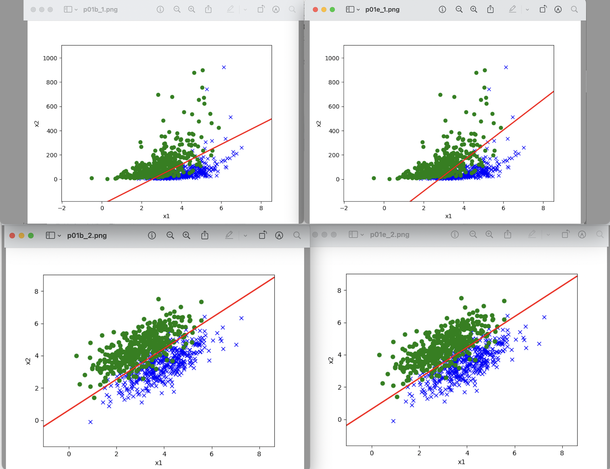

# Machine Learning [Stanford/CS229]
http://cs229.stanford.edu/syllabus-autumn2018.html
 
## Remark
This repo contains all the Problem Sets of CS229, which includes Mathematical and Programming projects.
```
Problem_Sets
/PSi/src is implemented by me
/solutions are written by CS229 course professor
/PSi/Sol is written by others, which is not completely right.
```
## Problem Set1
Libraries used: matplotlib.pyplot, numpy\
    plt.plot(x[y == 1, -2], x[y == 1, -1], 'bx', linewidth=2)
    plt.plot(x[y == 0, -2], x[y == 0, -1], 'go', linewidth=2)
    
### Problem 1(b): Logistic regression with Newton's Method. 
    Lecture Note1 Supervised Learning P21

### Problem 1(e): Gaussian Discriminant Analysis (GDA) Model 
    Lecture Note2 Generative Algorithms P2
 

For Dataset1, GDA performs worse than Logisitic regression.\
Probably, p(x|y) is not Gaussian Distribution.\
Improvement: Using Box-Cox transformation for Dataset1.

### Problem 2(cd): Incomplete, Positive-Only Labels
    Problem Set Specification
 
### Problem 3(d): Poisson regression with gradient ascent.
    Lecture Note1 Supervised Learning P22 One of the exponential family.
                                            Sigmoid Function
    Lecture Note1 Supervised Learning P26 Canonical Response Function
    Lecture Note1 Supervised Learning P19 Stochastic Gradient Ascent Update

### Problem 4: Convexity of Generalized Linear Models
    Lecture Note1 Supervised Learning P13 log likelihood
    • Any GLM model is convex in its model parameters.
    • The exponential family of probability distributions are mathematically nice. Whereas cal- culating mean and variance of distributions in general involves integrals (hard), surprisingly we can calculate them using derivatives (easy) for exponential family.

### Problem 5: Locally weighted linear regression
    Lecture Note1 Supervised Learning P14  
    Lecture Note1 Supervised Learning P11 the normal equation
